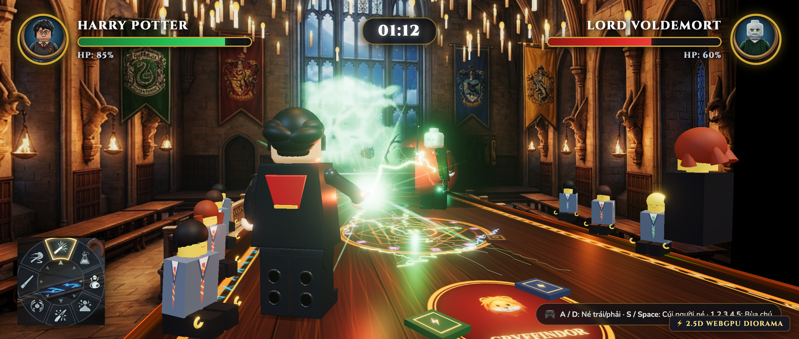
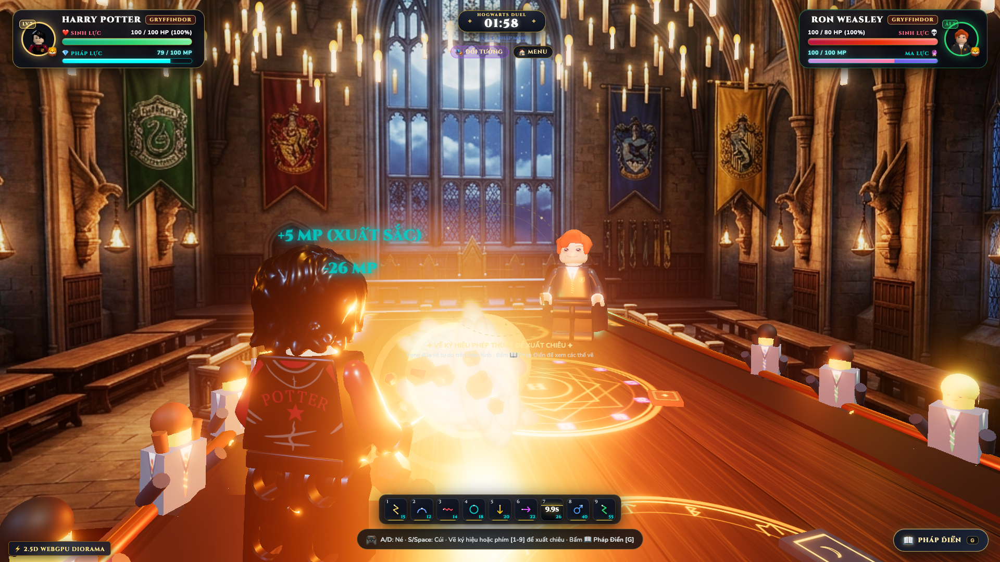
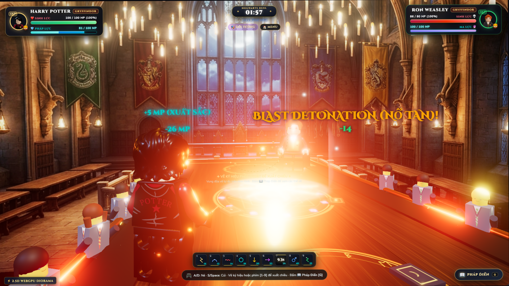
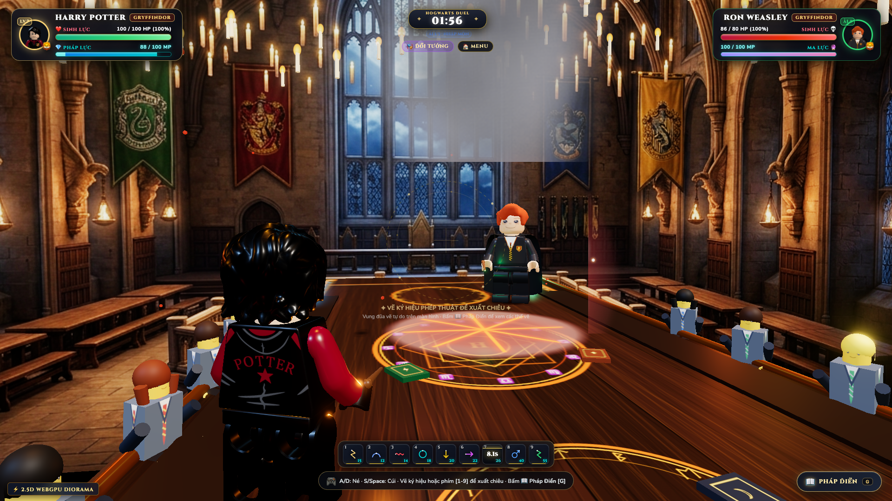

# ⚡ Hogwarts Lego 3D Duel · Harry Potter vs Lord Voldemort

> **CLB Đấu Tay Đôi Hogwarts 3D** — Trò chơi đấu pháp thuật thời gian thực chuẩn phong cách Lego Minifigure trên nền web, xây dựng bằng **Three.js (hỗ trợ WebGPU với WebGL2 Fallback)** và **TypeScript / Vite**.

🌐 **Chơi Trực Tiếp Trên Vercel**: [https://hogwarts-duel-3d.vercel.app](https://hogwarts-duel-3d.vercel.app)  
🐙 **Mã Nguồn GitHub (Standalone)**: [https://github.com/qkn202/hogwarts-duel-3d](https://github.com/qkn202/hogwarts-duel-3d)  
🌿 **Nhánh Độc Lập (Undercover)**: [https://github.com/qkn202/undercover-hogwarts/tree/hogwarts-duel-3d](https://github.com/qkn202/undercover-hogwarts/tree/hogwarts-duel-3d)  
🌿 **Nhánh Độc Lập (7 Potters)**: [https://github.com/qkn202/7-potters/tree/hogwarts-duel-3d](https://github.com/qkn202/7-potters/tree/hogwarts-duel-3d)  

[](https://hogwarts-duel-3d.vercel.app)
[](https://github.com/qkn202/hogwarts-duel-3d)
[](https://threejs.org/)
[](https://www.typescriptlang.org/)
[](https://vitejs.dev/)
[](https://www.w3.org/TR/webgpu/)

---



---

## 💥 Cập Nhật Đồ Hoạ Đỉnh Cao Mới Nhất (v1.3 - 05/10/2026)

### 1. Đại Tu Toàn Diện Bùa Nổ Tan Confringo (Blasting Curse)
Nâng cấp đồ hoạ hiệu ứng bộc phá đạt chuẩn điện ảnh AAA:
- **Đầu Đạn Dung Nham 3 Lớp:** Lõi nhiệt hạch trắng rực ($r=0.20$), màng vỏ magma vàng hổ phách ($r=0.26$) và hào quang cam lửa ($r=0.32$).
- **3 Vành Nén Siêu Thanh (Mach Shock Rings):** Ba vành xuyến Torus bao bọc đầu đạn co giãn nhịp nhàng theo gia tốc xé gió.
- **Chiếu Sáng Động Mặt Bàn:** Đèn điểm `PointLight(0xff6600, 28.0, 16.0)` quét rọi rực sáng toàn bộ mặt bàn gỗ Mahogany và dãy ghế khán giả.
- **Quầng Nổ Hoa Súp Lơ (Cauliflower Fireball) Đường Kính 3.2m:** Texture Canvas 1024×1024 thủ công với viền suy giảm alpha mềm mại, dập tắt hoàn toàn lỗi viền cứng đa giác hay hiệu ứng bìa các-tông.
- **Sóng Chấn Động Kép Mặt Bàn:** Hai vòng plasma phẳng lan rộng quét sát mặt sàn ở $y = -0.808$.
- **28 Tia Lửa Starburst & 18 Mảnh Nham Thạch:** Bắn toé 360°, chịu gia tốc trọng lực rơi và nảy nổ vật lý trên mặt bàn.
- **Cột Khói Than Muội & Vết Nứt Magma:** Cột khói đen than củi tự nhiên cuộn tròn bốc lên trần Đại Sảnh, để lại vết cháy sạm loang lổ cùng các đường nứt dung nham âm ỉ nguội dần sau 2.6s.

| Khung Hình Bay (Flight) | Điểm Nổ Bộc Phá (Impact) | Cột Khói & Vết Cháy (Smoke) |
| :---: | :---: | :---: |
|  |  |  |

### 2. Thần Hộ Mệnh Expecto Patronum (Patronus Charm)
- **Bạch Lộc Thần 3D Độc Bản:** Mô hình chú hươu đực ánh trăng đạp mặt bàn phi thẳng về phía kẻ thù với tư thế điện ảnh.
- **Hào Quang Bạch Ngân Tinh Khiết:** Luồng sương mù linh hồn phát quang dập tan bóng tối và hồi phục ngay lập tức **8% sinh lực** cho người thi triển.

### 3. Hệ Thống Nhận Diện Thủ Ấn Tự Do (Freehand Rune Drawing)
- Tự do vung đũa vẽ trực tiếp trên màn hình:
  - ⚡ **Tia Sét (Z):** *Expelliarmus*
  - 🛡️ **Vòm Cung (Arc):** *Protego*
  - 💫 **Đường Sóng (Wave):** *Stupefy*
  - 🌀 **Vòng Xoáy (Loop):** *Obliviate*
  - 🔒 **Đường Thẳng Đâm Xuống (Line Down):** *Petrificus Totalus*
  - 🩸 **Nhát Chém Ngang (Slash Right):** *Sectumsempra*
  - 💥 **Tam Giác (Triangle):** *Confringo*
  - 🦌 **Vòng Tròn Mũi Tên (Patronus Rune):** *Expecto Patronum*
  - 💀 **Ký Hiệu Tử Thần (Lightning Bolt / K):** *Avada Kedavra*

---

## 🌟 Điểm Nổi Bật & Tính Năng Trò Chơi

### 1. Đồ Hoạ Đỉnh Cao Post-Processing (PBR + UnrealBloom)
- **UnrealBloomPass**: Ánh sáng neon ma thuật chói lọi, tương phản chân thực giữa căn phòng đại sảnh cổ kính.
- **Lego PBR Materials**: Vật liệu nhựa bóng clearcoat, phản xạ kim loại, khớp tay chân cơ học Lego nguyên bản.
- **Không Gian 2.5D Hogwarts Diorama**: Ánh nến lơ lửng bập bùng, cờ 4 nhà Gryffindor, Slytherin, Ravenclaw, Hufflepuff và các học sinh ngồi cổ vũ hai bên.

### 2. Cơ Chế Thân Pháp & Hitbox Né Đòn Cố Định (Kinematic Dodge)
Không di chuyển tự do vô nghĩa; hai đấu sĩ giữ thế đứng danh dự của Hội Đấu Tay Đôi:
- **Nghiêng Thân Trái / Phải (`A` / `D`)**: Nghiêng hông và đầu né tia phép bắn thẳng.
- **Cúi Thấp Trọng Tâm (`S` / `Space`)**: Gập gối hạ thấp cơ thể né đòn đánh tầm ngực.
- **Phản Đòn Hoàn Hảo (Perfect Parry)**: Bật khiên *Protego* đúng thời điểm tiếp đạn để hất ngược đòn đánh và hồi phục năng lượng Mana!

### 3. Đọ Phép Lực Lịch Sử (Priori Incantatem / Spell Clash)
Khi hai tia phép nghịch đảo chạm nhau trực tiếp giữa không trung:
- Lõi năng lượng hạt nổ tung rực rỡ tại trung tâm bàn đấu.
- Nhịp tim dồn dập, người chơi liên tục nhấp chuột/gõ phím để dồn lực đẩy luồng tia phép về phía đối phương.

### 4. Hai Chế Độ Đấu Đỉnh Cao
- 🏰 **Chiến Dịch Gauntlet (5 Ải Thử Thách)**: Đơn thương độc mã vượt qua 5 bậc thầy phù thủy:
  1. *Ải 1 — Alastor "Mắt Điên" Moody* (Nhập Môn · 80 HP)
  2. *Ải 2 — Remus Lupin* (Tập Sự · 90 HP)
  3. *Ải 3 — Ron Weasley* (Cao Thủ · 100 HP)
  4. *Ải 4 — Tom Riddle thời trẻ* (Đại Sư · 110 HP)
  5. *Ải 5 — Chúa Tể Voldemort* (Huyền Thoại · 125 HP)
- ⚡ **Đấu Trực Tuyến P2P Multiplayer (4 Bùa Xuất Trận)**:
  - Tự do build bộ bài 4 bùa phép tâm đắc nhất từ Pháp Điển.
  - Tạo phòng nhận mã code, chép link mời 1-chạm gửi bạn bè thi đấu thời gian thực.

---

## 📖 Kho 9 Đại Pháp Thuật (Spell Arsenal)

| Phím | Ký Hiệu | Thần Chú | Loại / Hiệu Ứng | Sát Thương | Hồi Chiêu | Mô Tả Chiến Thuật |
| :---: | :---: | :---: | :---: | :---: | :---: | :--- |
| **`1`** | ⚡ | **Expelliarmus** | Tia Đỏ Rực (*Scarlet Jet*) | 15 | 3.0s | **Bùa Tước Khí Giới**: Tốc độ bay cực nhanh (16m/s), tước đũa đối thủ văng rơi vật lý xuống bàn. |
| **`2`** | 🛡️ | **Protego** | Khiên Đa Giác (*Cerulean*) | 0 | 4.0s | **Bùa Khiên Bảo Vệ**: Triệt tiêu 100% sát thương. Phản đòn khi chặn trước 0.5s và hồi 12 MP. |
| **`3`** | 💫 | **Stupefy** | Hào Quang Đỏ (*Stun Crimson*) | 18 | 6.0s | **Bùa Choáng Váng**: Tác động tức thì, đẩy lùi và làm đối thủ choáng ngợp bất động trong 1.8s. |
| **`4`** | 🌀 | **Obliviate** | Lốc Xoáy Cyan (*Memory Wipe*) | 0 | 6.5s | **Bùa Xóa Ký Ức**: Hủy chiêu đang niệm của đối thủ, gây lú lẫn và giảm tầm ngắm trong 2.0s. |
| **`5`** | 🔒 | **Petrificus Totalus** | Dây Trói Bạc (*Stone Bind*) | 0 | 8.0s | **Lời Nguyền Hóa Đá**: Khóa cứng toàn thân đối thủ trong 2.2s, hoàn toàn không thể vung đũa. |
| **`6`** | 🩸 | **Sectumsempra** | Vết Chém Máu (*Dark Slash*) | 28 | 9.0s | **Lời Nguyền Chém Sâu**: Gây sát thương tức thì và xuất huyết -1 HP liên tục 3 đợt. |
| **`7`** | 💥 | **Confringo** | Bộc Phá Cam (*Cauliflower Blast*) | 35 | 10.0s | **Bùa Nổ Tan**: Khối cầu lửa bùng nổ 3.2m, rung chấn màn hình cực mạnh và để lại vết cháy than củi. |
| **`8` / `P`** | 🦌 | **Expecto Patronum** | Bạch Lộc 3D (*Pure Silver*) | 38 | 14.0s | **Thần Hộ Mệnh**: Bạch hươu phi qua bàn đấu hất tung đối thủ, đồng thời hồi phục 8% sinh lực cho Harry. |
| **`9` / `K`** | 💀 | **Avada Kedavra** | Tia Lục Chết Chóc (*Death Ray*) | **65** | 20.0s | **Lời Nguyền Chết Chóc**: Luồng chớp xanh lục bảo kết nối trực tiếp mục tiêu cùng đầu lâu khói Tử Thần. |

---

## 🎮 Hướng Dẫn Điều Khiển (Controls)

| Phím / Thao Tác | Hành Động |
| :--- | :--- |
| **`A`** hoặc **`ArrowLeft`** | Nghiêng người sang trái né tia phép |
| **`D`** hoặc **`ArrowRight`** | Nghiêng người sang phải né tia phép |
| **`S`** / **`Space`** / **`ArrowDown`** | Cúi rạp người hạ thấp trọng tâm |
| **Phím số `[1]` - `[9]`** | Thi triển nhanh 9 bùa phép tương ứng |
| **Giữ chuột / Vuốt màn hình** | Vẽ thủ ấn cử chỉ phép thuật trực tiếp trên màn hình |
| **`G`** | Mở/Đóng Pháp Điển ma thuật (Grimoire Modal) |
| **`C`** | Chuyển đổi qua lại 4 góc máy quay (Cinematic / Side / Mobile / Portrait) |
| **Chuột trái (Click)** | Nhấp vào các ô phép trên thanh Dock ma thuật |

---

## 🛠️ Cài Đặt & Phát Triển Cục Bộ

```bash
# 1. Cài đặt các gói phụ thuộc
npm install

# 2. Khởi chạy máy chủ phát triển
npm run dev
# Truy cập: http://localhost:5180

# 3. Đóng gói kiểm tra sản phẩm
npm run build
npm run preview
```

---

## 📜 Giấy Phép & Bản Quyền
Dự án được phát triển phi thương mại phục vụ mục đích nghiên cứu công nghệ WebGL/WebGPU 3D, mô phỏng cơ chế vật lý thời gian thực và tôn vinh thế giới phù thủy Harry Potter.
- Thế giới phù thủy Harry Potter thuộc bản quyền của J.K. Rowling và Warner Bros. Entertainment Inc.
- Thiết kế nhân vật Minifigure thuộc bản quyền của The LEGO Group.
